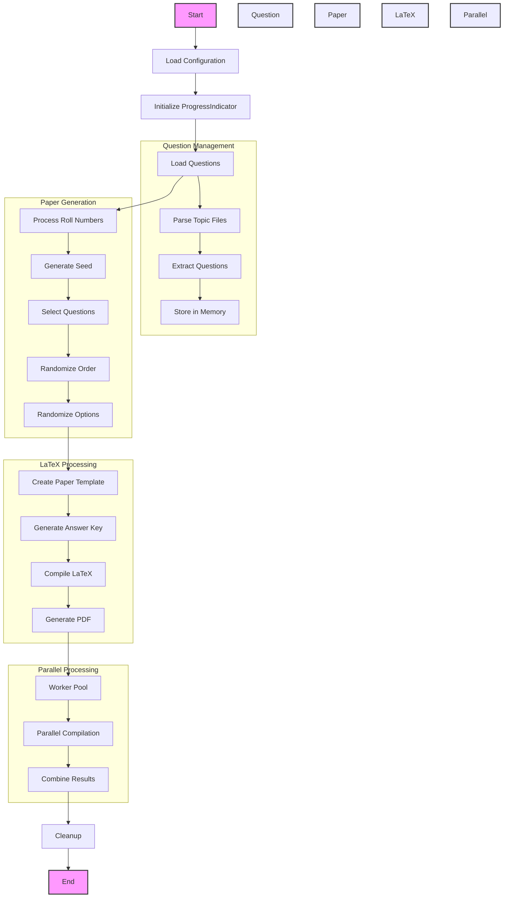

# PyTeXMCQ

A Python-based tool for generating randomized multiple-choice quiz papers and answer keys in LaTeX format. Perfect for educators who need to create different versions of the same quiz for multiple students while maintaining consistency and professional formatting.

## Features

- 🔑 Generates unique quiz versions for each student using roll numbers as seeds
- 📑 Automatically creates answer keys
- 📐 Maintains consistent formatting across all versions
- 📚 Combines all quizzes and answer keys into consolidated PDFs
- ⚙️ Supports custom LaTeX preamble for advanced formatting
- ⚡ Compiles documents in parallel for better performance
- 📄 Adds blank pages when needed for easier printing
- 📊 Automatically calculates and displays total marks

## Technical Architecture

The codebase is built around two main classes that handle different aspects of the quiz generation process:

### 1. ProgressIndicator Class
This class provides a visual progress indicator during the quiz generation process. It features:
- An animated spinner with percentage completion
- Smooth percentage transitions
- Thread-safe operation
- Customizable messages
- Success/failure status indicators

### 2. QuestionPaperGenerator Class
This is the core class that handles the quiz generation process. It consists of several key components:

#### Question Management
- **Question Loading**: Loads questions from `.tex` files in the topics directory
- **Question Parsing**: Splits questions into individual components and extracts marks
- **Question Randomization**: Uses roll numbers as seeds to ensure consistent randomization

#### Paper Generation
- **Seed Generation**: Converts roll numbers into consistent integer seeds using MD5 hashing
- **Option Randomization**: Randomizes multiple-choice options while preserving correct answers
- **Paper Assembly**: Combines questions, formatting, and student information
- **Answer Key Generation**: Creates parallel answer keys with correct choices marked

#### LaTeX Processing
- **Temporary Directory Management**: Creates isolated workspaces for each compilation
- **Parallel Compilation**: Uses multiprocessing to compile multiple papers simultaneously
- **Error Handling**: Provides detailed error messages for LaTeX compilation issues
- **PDF Merging**: Combines individual papers into consolidated PDFs

#### Configuration Handling
The system uses a JSON configuration file (`config.json`) that defines:
- Number of questions per topic
- Roll number patterns
- Topic-specific settings

### Workflow
1. The system reads questions from topic-specific `.tex` files
2. For each roll number:
   - Generates a unique seed based on the roll number
   - Randomizes question order and options
   - Creates both question paper and answer key
   - Compiles LaTeX files to PDF
3. Combines all papers and answer keys into consolidated PDFs
4. Cleans up temporary files

### Key Technical Features
- **Deterministic Randomization**: Same roll number always gets the same paper
- **Parallel Processing**: Uses Python's multiprocessing for faster compilation
- **Memory Management**: Uses temporary directories to prevent file system clutter
- **Error Resilience**: Comprehensive error handling and reporting
- **Modular Design**: Easy to extend with new question types or features

## System Flowchart

The following flowchart breaks down the system into its core functional components and their interactions:



### Component Descriptions

1. **Configuration Loading**
   - Reads `config.json`
   - Validates settings
   - Initializes system parameters

2. **Question Management**
   - Loads and parses `.tex` files
   - Extracts questions and marks
   - Organizes by topic
   - Maintains question bank

3. **Paper Generation**
   - Creates unique seeds from roll numbers
   - Selects questions based on configuration
   - Randomizes question order
   - Randomizes multiple-choice options

4. **LaTeX Processing**
   - Generates LaTeX templates
   - Creates answer keys
   - Handles compilation
   - Manages PDF generation

5. **Parallel Processing**
   - Manages worker pool
   - Distributes compilation tasks
   - Combines results
   - Handles errors

6. **Cleanup**
   - Removes temporary files
   - Consolidates output
   - Reports completion

## Prerequisites

- Python 3.8 or higher
- LaTeX distribution (TeX Live or MiKTeX)
- `pdflatex` command-line tool

## Installation

1. Clone this repository:
   ```bash
   git clone https://github.com/ArnabCodes/PyTeXMCQ.git
   cd PyTeXMCQ
   ```

2. Create and activate a virtual environment (optional):
   ```bash
   python -m venv .venv
   source .venv/bin/activate  # On Windows, use `.venv\Scripts\activate`
   ```

3. Verify LaTeX installation:
   ```bash
   pdflatex --version
   ```

## Project Structure

```
PyTeXMCQ/
├── generate_papers.py     # Main script for generating quizzes
├── preamble.tex          # LaTeX preamble with formatting
├── config.json           # Configuration file
└── topics/              # Directory for question banks
```

## Usage

1. Create your question bank:
   - Place your questions in `.tex` files in the `topics/` directory
   - Follow the template format:
     ```latex
     \begin{question}[2]  % Points for this question
     Your question here
     \begin{oneparcheckboxes}
     \choice Option A
     \correctchoice Option B
     \choice Option C
     \choice Option D
     \end{oneparcheckboxes}
     \end{question}
     ```
   - If no points are specified, the question is worth 1 mark
   - For consistent total marks across papers, group questions with same marks in the same file

2. Configure the generator:
   - Edit `config.json` to specify:
     - Number of questions per topic
     - Roll number patterns (e.g., "BT24ECE01...04")

3. Generate quizzes:
   ```bash
   python generate_papers.py
   ```

4. Find your output:
   - `papers.pdf`: All question papers merged
   - `answers.pdf`: All answer keys merged

## Important Notes

- Roll numbers act as seeds for randomization, ensuring the same roll number always gets the same paper
- Questions are compiled in parallel for better performance
- Total marks are automatically calculated and displayed
- Blank pages are added when needed for easier double-sided printing
- For consistent total marks, group questions with same marks in the same file

## Configuration

### config.json
```json
{
    "questions_per_topic": {
        "semiconductor_physics": 10,
        "device_physics": 10,
        "laser_optics": 1
    },
    "roll_numbers": [
        "BT24ECE01...04",
        "BT24ECE10",
        "BT24ECE15...18"
    ]
}
```

### preamble.tex
Customize your quiz appearance by modifying:
- Page layout
- Font settings
- Header/footer content
- Question formatting

## Contributing

We welcome contributions! Here's how you can help:

1. Fork the repository
2. Create a feature branch
3. Make your changes
4. Submit a pull request

### Areas for Contribution
- Add support for different question types
- Implement question difficulty levels
- Add support for images and diagrams
- Create a GUI interface
- Improve error handling
- Add unit tests

## License

This project is licensed under the MIT License - see the LICENSE file for details. 